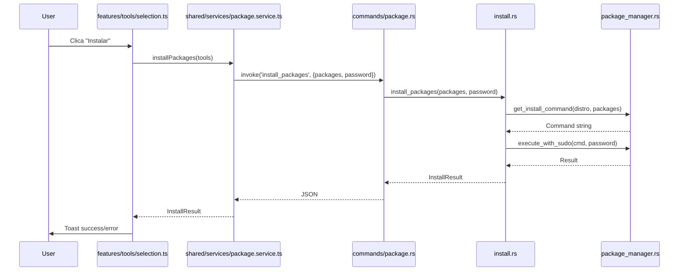
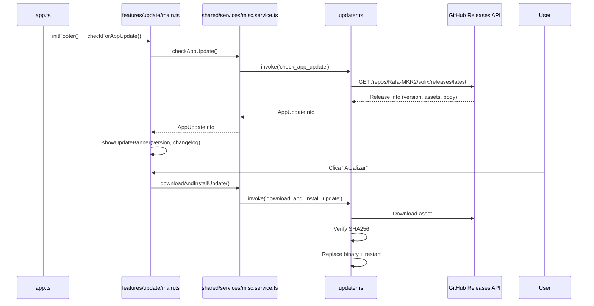
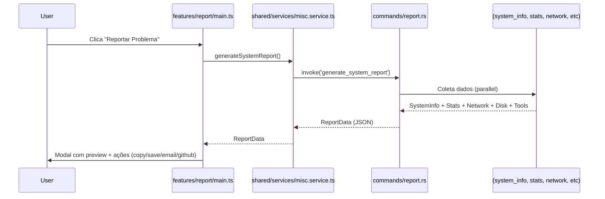

# 🏗️ Arquitetura do Solix

> **Propósito:** Documento de referência da arquitetura final após refatoração (17 fases). Para desenvolvedores, contribuidores e agentes de IA.

---

## 📖 Contexto Rápido

O Solix é uma aplicação desktop **Tauri v2** (Rust + WebView) para gerenciar Linux. A refatoração transformou:

| Antes | Depois |
|-------|--------|
| `lib.rs` ~800 linhas | `lib.rs` ~150 linhas (orquestrador) |
| Frontend monolítico (`app.ts`, `ui.ts`, `operations.ts` ~800 cada) | `features/` + `shared/` por responsabilidade |
| `invoke()` direto em todo lugar | **Regra:** UI → `shared/services/` → Tauri |

---

## 🎯 Princípios Arquiteturais

### 1. Separação de Responsabilidades

```
┌─────────────────────────────────────────────────────────────┐
│                      TAURI WEBVIEW                          │
├─────────────────────────────────────────────────────────────┤
│  FRONTEND (TypeScript)                                      │
│  ┌─────────────┐  ┌─────────────────────────────────────┐  │
│  │  features/  │  │           shared/                   │  │
│  │  (business  │  │  (reutilizável, sem regra de        │  │
│  │   logic)    │  │   negócio)                          │  │
│  └──────┬──────┘  └──────────────┬──────────────────────┘  │
│         │                        │                          │
│         ▼                        ▼                          │
│  ┌─────────────────────────────────────────┐               │
│  │         shared/services/                │               │
│  │  (ÚNICO ponto de comunicação Tauri)     │               │
│  └────────────────┬────────────────────────┘               │
└───────────────────┼────────────────────────────────────────┘
                    │ IPC (invoke)
                    ▼
┌─────────────────────────────────────────────────────────────┐
│  BACKEND (Rust)                                             │
│  ┌─────────────┐  ┌─────────────────────────────────────┐  │
│  │  commands/  │  │         Domain Modules              │  │
│  │  (Tauri     │  │  (install, tool, stats, network,    │  │
│  │   handlers) │  │   system_info, distribution, etc)   │  │
│  └──────┬──────┘  └──────────────┬──────────────────────┘  │
│         │                        │                          │
│         ▼                        ▼                          │
│  ┌─────────────────────────────────────────┐               │
│  │           lib.rs (~150 linhas)          │               │
│  │         Orquestrador puro               │               │
│  └─────────────────────────────────────────┘               │
└─────────────────────────────────────────────────────────────┘
```

### 2. Regras de Ouro

| Regra | Descrição |
|-------|-----------|
| **UI nunca chama Tauri** | Sempre via `shared/services/` |
| **Features não se conhecem** | Comunicação via `shared/` ou eventos |
| **Estado auth centralizado** | `shared/auth.ts` → `passwordVerified` |
| **Diálogos via `shared/dialogs/`** | Não criar modais inline |
| **Componentes via `shared/components/`** | Base visual consistente |
| **Backend: commands = handlers, modules = lógica** | `lib.rs` só registra |

---

## 📁 Estrutura de Pastas

### Frontend (`src-ts/`)

```
src-ts/
├── app.ts                      # Bootstrap (~100 linhas) + delegação dynamic imports
├── features/                   # 9 features, cada uma autossuficiente
│   ├── home/
│   │   ├── gauges.ts           # SVG circular gauges (setGauge, CIRCUMFERENCE)
│   │   ├── stats.ts            # loadHomeStats, pollStats (3s interval)
│   │   └── index.ts
│   ├── disks/
│   │   ├── main.ts             # renderDisks, openFileManager, analyzeDisk, partitions
│   │   ├── smart.ts            # handleShowSmartInfo
│   │   ├── backup.ts           # showBackupModal, handleStartBackup
│   │   └── index.ts
│   ├── tools/
│   │   ├── selection.ts        # selectedTools, toggleInstall/Remove, updateButtons
│   │   ├── render.ts           # renderTools, categoryLabels, categoryOrder
│   │   ├── shortcuts.ts        # askDesktopShortcuts
│   │   └── index.ts
│   ├── packages/
│   │   ├── upload.ts           # handlePkgFileSelect, readFileAsBase64, pendingPkg
│   │   ├── installed.ts        # loadInstalledPackages, handleRemovePackages
│   │   ├── repository.ts       # handleSearchRepoPackages, handleInstallRepoPackages
│   │   ├── history.ts          # loadPackageHistory
│   │   └── index.ts
│   ├── network/
│   │   ├── main.ts             # loadConnectivity, loadExternalInfo
│   │   ├── tests.ts            # handleTestPingClick, handleTestSpeedClick
│   │   └── index.ts
│   ├── script/
│   │   ├── analyzer.ts         # handleScriptDrop, handleAnalyzeText
│   │   ├── renderer.ts         # renderScriptAnalysis
│   │   └── index.ts
│   ├── update/
│   │   ├── banner.ts           # showUpdateBanner, showUpdateProgress
│   │   ├── main.ts             # setupUpdateListener, handleAppUpdate, checkForAppUpdate
│   │   └── index.ts
│   ├── report/
│   │   ├── main.ts             # showReportModal, reportProblem, copy/save/email/github
│   │   ├── modal.ts            # DOM do modal (separado da lógica)
│   │   └── index.ts
│   └── developer/
│       ├── github.ts           # handleGitHubLinkClick, setupGitHubLink
│       ├── message.ts          # renderRoadmap, initDeveloperPage
│       └── index.ts
├── shared/
│   ├── components/             # 7 componentes visuais
│   │   ├── Modal.ts            # Modal class + confirm() static
│   │   ├── Card.ts             # createCard, createStatCard
│   │   ├── Gauge.ts            # createGauge, updateGauge (SVG animado)
│   │   ├── ProgressBar.ts      # createProgressBar, updateProgressBar, indeterminate
│   │   ├── Badge.ts            # createBadge, createStatusBadge, createCountBadge
│   │   ├── Toast.ts            # showToast + variants (success/error/warning/info/loading)
│   │   ├── Table.ts            # createTable (sort, filter, search, clickable rows)
│   │   └── index.ts
│   ├── dialogs/                # 6 diálogos modais tipados
│   │   ├── Dialog.ts           # Base class (overlay, ESC, focus trap, footer)
│   │   ├── PasswordDialog.ts   # 6 tipos: install, remove, zram, cleanup, app-update, install-package
│   │   ├── UpdateDialog.ts     # 2 views: info (version+changelog) + progress
│   │   ├── BackupDialog.ts     # 3 states: config → progress → result
│   │   ├── ReportDialog.ts     # Loading → content → result
│   │   ├── ConfirmDialog.ts    # Generic + danger/warning variants + helpers
│   │   └── index.ts
│   ├── services/               # 8 services (wrappers Tauri)
│   │   ├── system.service.ts   # getHomeStats, getStats, checkAppUpdate
│   │   ├── package.service.ts  # install/remove, inspectPackageData, installPackageData, checkPmLock
│   │   ├── network.service.ts  # getConnectivity, getExternalInfo, testPing, testSpeed
│   │   ├── disk.service.ts     # openFileManager, analyzeUsage, getPartitionTable, getSmartInfo
│   │   ├── process.service.ts  # getProcesses, killProcess, removeLockFiles
│   │   ├── backup.service.ts   # startBackup, getBackupStatus
│   │   ├── script.service.ts   # analyzeScript
│   │   ├── misc.service.ts     # enableZram, cleanupSystem, openUrl, getPackageInfo
│   │   └── index.ts
│   ├── utils/
│   │   ├── tauri.ts            # invoke wrapper tipado
│   │   ├── escape.ts           # HTML escape
│   │   ├── dom.ts              # DOM helpers (qs, qsa, on, off, delegate)
│   │   ├── toast.ts            # Re-export de Toast component
│   │   └── index.ts
│   ├── types/
│   │   └── index.ts            # ~35 interfaces (Tool, PackageInfo, SystemStats, etc.)
│   └── auth.ts                 # passwordVerified state + get/set
├── animations.ts               # Confetes, animações
├── utils.ts                    # Re-export shared/utils
└── types.ts                    # Re-export shared/types
```

### Backend (`src-tauri/src/`)

```
src-tauri/src/
├── main.rs                     # Entry point
├── lib.rs                      # Orquestrador (~150 linhas) - registra 25 comandos
├── commands/                   # Tauri command handlers (16 arquivos)
│   ├── disk.rs                 # analyze_disk_usage, get_partition_table
│   ├── smart.rs                # get_disk_smart_info
│   ├── report.rs               # generate_system_report
│   ├── process.rs              # kill_process, check_pm_lock, remove_lock_files
│   ├── desktop.rs              # create_desktop_shortcut
│   ├── misc.rs                 # open_file_manager, get_package_info, check_app_update
│   ├── package.rs              # install_packages, remove_packages
│   ├── stats.rs                # get_system_stats, get_home_stats
│   ├── system_info.rs          # get_system_info
│   ├── network.rs              # get_connectivity, get_external_info, test_ping, test_speed
│   ├── tool.rs                 # get_tools
│   ├── updater.rs              # check_app_update, download_and_install_update
│   ├── backup.rs               # start_backup, get_backup_status
│   ├── script.rs               # analyze_script
│   ├── distribution.rs         # (domain - detecção distro)
│   └── user.rs                 # (domain - info usuário)
├── Domain Modules (lógica de negócio)
│   ├── distribution.rs         # parse_os_release, detect_distro
│   ├── executable.rs           # scan_path_executables
│   ├── install.rs              # package mapping, multi-distro install/remove
│   ├── network.rs              # ping, wifi, bluetooth, battery
│   ├── package_info.rs         # package metadata + icons
│   ├── stats.rs                # /proc parsing, CPU, mem, disk, processes
│   ├── system_info.rs          # CPU, RAM, disks, GPU hardware
│   ├── system_ops.rs           # ZRAM, cleanup, battery
│   ├── tool.rs                 # tool catalog (80+ tools, 9 categories)
│   ├── user.rs                 # parse_passwd, user info
│   ├── updater.rs              # auto-update flow (download, SHA256, install, restart)
│   ├── password.rs             # sudo cache base64, verify, pipe_password
│   ├── package_installer.rs    # local .deb/.rpm install
│   ├── package_manager.rs      # abstraction: pacman/apt/dnf/zypper
│   ├── backup.rs               # tar.gz backup creation
│   ├── script_analyzer.rs      # static analysis shell scripts
│   └── util.rs                 # sanitize_path, helpers
├── tauri.conf.json
└── Cargo.toml
```

---

## 🔄 Fluxos Principais

### 1. Instalação de Ferramenta (Frontend → Backend)



### 2. Auto-Update



### 3. Relatório do Sistema



---

## 📦 Padrões de Código

### Frontend — Nova Feature

```typescript
// src-ts/features/minha-feature/main.ts
import { systemService } from '../../shared/services';

export async function loadMinhaFeatureData() {
  const data = await systemService.getHomeStats(); // SEMPRE via service
  render(data);
}

export function initMinhaFeature() {
  // setup listeners, etc.
}

// src-ts/features/minha-feature/index.ts
export { loadMinhaFeatureData, initMinhaFeature } from './main';
```

```typescript
// src-ts/app.ts - registro
import { initMinhaFeature } from './features/minha-feature';

// No DOMContentLoaded:
initMinhaFeature();
```

### Backend — Novo Comando

```rust
// src-tauri/src/commands/meu_dominio.rs
use tauri::command;

#[command]
pub async fn meu_comando(param: String) -> Result<MeuResultado, String> {
    // Validação
    // Delega para domain module
    Ok(meu_modulo::executar(param).await?)
}

// src-tauri/src/lib.rs
mod commands {
    pub mod meu_dominio;
}
// No invoke_handler:
tauri::generate_handler![
    commands::meu_dominio::meu_comando,
    // ...
]
```

### Service Frontend (Wrapper Tauri)

```typescript
// src-ts/shared/services/meu.service.ts
import { invoke } from '../utils/tauri';

export const meuService = {
  async meuMetodo(param: string): Promise<MeuResultado> {
    return invoke('meu_comando', { param });
  },
};
```

---

## 🔐 Autenticação Sudo

```typescript
// shared/auth.ts
let passwordVerified = false;

export function setPasswordVerified(v: boolean) { passwordVerified = v; }
export function getPasswordVerified() { return passwordVerified; }
```

```rust
// password.rs
pub fn verify_password(password: &str) -> Result<bool, String>
pub fn pipe_password(password: &str, cmd: &mut Command) -> Result<Output, String>
// Cache base64 com expiração (5 min)
```

**Fluxo:** UI → `PasswordDialog` (shared/dialogs) → `password.rs::verify_password` → cache → operações subsequentes usam cache.

---

## 🧪 Testes

| Camada | Comando | Cobertura |
|--------|---------|-----------|
| Rust | `cargo test` | 442 testes (parse, structs, sanitização, catálogo, updater, senha, backup) |
| TypeScript | `npx tsc` | Type checking (0 erros) |
| Frontend | *Futuro* | Vitest + mocks Tauri (meta: ≥50%) |

**Princípio:** Testes Rust **nunca** usam rede — HTTP mockado via structs injetadas.

---

## 📏 Limites de Tamanho

| Arquivo | Limite | Atual |
|---------|--------|-------|
| `lib.rs` | ≤150 linhas | ~150 ✅ |
| Feature module | ≤200 linhas | 30-200 ✅ |
| Shared module | ≤300 linhas | <300 ✅ |
| `app.ts` | ≤100 linhas | ~100 ✅ |

---

## 🚀 Adicionando Funcionalidade

### Checklist Nova Feature Frontend

- [ ] Criar `src-ts/features/<nome>/` com `main.ts` + `index.ts`
- [ ] Usar `shared/services/` para backend
- [ ] Usar `shared/components/` + `shared/dialogs/` para UI
- [ ] Tipos em `shared/types/index.ts` se compartilhados
- [ ] Registrar em `app.ts` via dynamic import
- [ ] `npx tsc` — zero erros

### Checklist Novo Comando Backend

- [ ] Criar `src-tauri/src/commands/<dominio>.rs`
- [ ] Implementar handler + registrar em `lib.rs`
- [ ] Adicionar method em `shared/services/<dominio>.service.ts`
- [ ] `cargo test` + `npx tsc` passando

---

## 🔗 Referências

- **Roadmap & Status:** [`solix-docs/roadmap/planned.md`](../solix-docs/roadmap/planned.md)
- **Plano Refatoração:** [`solix-docs/roadmap/refactoring-plan.md`](../solix-docs/roadmap/refactoring-plan.md)
- **Cobertura Testes:** [`solix-docs/testing/coverage.md`](../solix-docs/testing/coverage.md)
- **Agentes IA:** [`solix-docs/ai-agents/INDEX.md`](../solix-docs/ai-agents/INDEX.md)
- **Decisões (ADRs):** [`solix-docs/decisions/`](../solix-docs/decisions/)

---

*Última atualização: 2026-08-01 | Refatoração 17/17 fases concluídas | Próximo: Fase 18 Documentação*